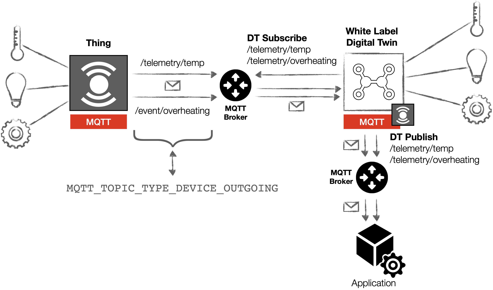
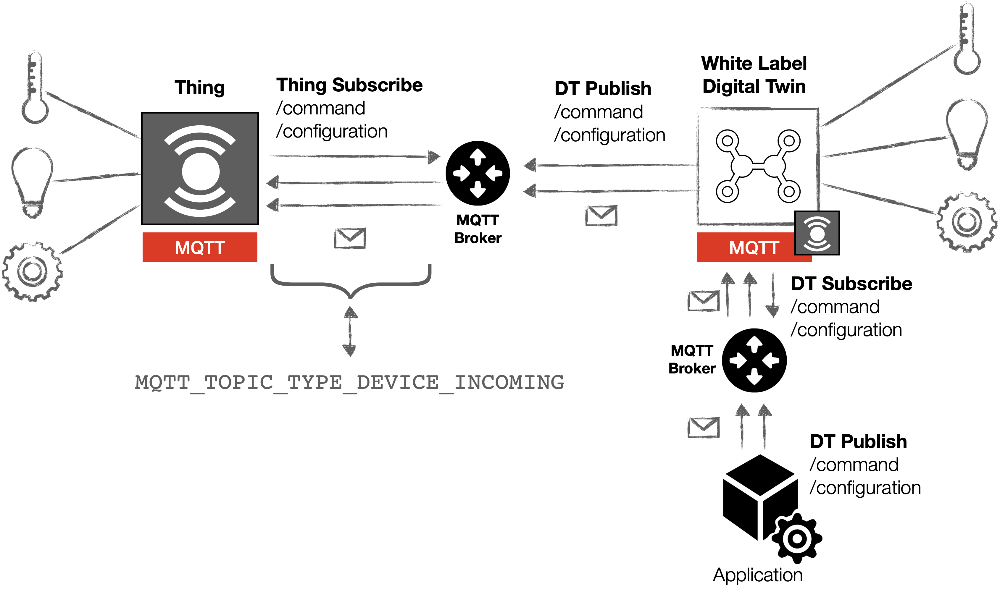

# WhiteLabel Digital Twin Framework - Core Library

Core library and repository of the White Label Digital Twin (WLDT) 
Framework. The WLDT intends to maximize modularity, re-usability and flexibility in order to effectively mirror 
physical smart objects in their digital counterparts. 
The proposed library focuses on the simplification of twins design and 
development aiming to provide a set of core features and 
functionalities for the widespread adoption of Internet of Things digital twins applications. 

A White Label Digital Twin (WLDT) instance is a general purpose software agent 
implementing all the features and functionalities of a Digital Twin running 
in cloud or on the edge. It has the peculiar characteristic 
to be generic and ``attachable'' to any physical thing in order to 
impersonate and maintain its digital replica and extend the provided functionalities 
for example through the support of additional protocols or a specific translation 
or normalization for data and formats.

Hereafter, the requirements that led the design and development of the WLDT framework are: 
- i) Simplicity - with WLDT developers must have the possibility to easily create a new instance by using 
existing modules or customizing the behavior according the need of their application scenario; 
- ii) Extensibility - while WLDT must be as simple and light as possible, 
the API should be also easily extendible in order to let programmers to personalize 
the configuration and/or to add new features loading and executing multiple modules at the same times;
- iii) Portability & Micorservice Readiness - a digital twin implemented through WLDT must 
be able to run on any platform without changes and customization. Our goal is to have a simple and light core engine 
with a strategic set of IoT-oriented features allowing the developer to easily create DT applications modeled 
as independent software agents and packed as microservices.


<p align="center">
  
</p>

The core layer of the solution is the WLDT Engine designed 
to handle and orchestrate available and active modules 
(denoted as Workers) defining the behavior of the twin. 
A Worker is the active module of the framework and it 
is designed to implement a specific twin's task or feature 
related for example to the synchronization with the 
original physical counterpart through a target IoT protocol. 
WLDT Workers' implements all the available communication 
protocols supported by the digital replica involving 
both standard and well known protocols such as 
CoAP or MQTT. 
Legacy protocols may be adopted in specific IoT deployments through the implementation of a dedicated module. Each worker is responsible to support both Request/Response or Pub/Sub paradigms and synchronization 
features for both incoming and outgoing communications.

Since the aim of the framework is to support scalability 
and extensibility, the possibility for developers 
to quickly define dynamic behaviors into existing or 
new WLDT workers has been introduced in the library. 
Through the "Processing Pipeline" layer developers 
can define a list of personalized processing steps 
dedicated for example to legacy incoming/outgoing packets management, 
the integration with an external third party services or to data format 
translation and adaptation. The processing units can be also dynamically loaded 
at the configuration level and re-used across multiple WLDT instances.  

## Getting started

For developing a Digital Twin instance using the WLDT framework you have only to:

* download the WLDT library through the .jar file or download the wldt-core maven project and install it in your locale repository;
* develop your app using the ZWT library; for example if you are using a PC with Java SE, you can you the corresponding ZWT jar for this phase;
* develop the entry class used for starting your app in the target platform(s).

### WLDT Worker Configuration

The interface WldtWorkerConfiguration allows to create your personal data structure containing all the needed information for 
your new Worker to clone its physical counterpart and start operating. In the following example a new DummyConfiguration is created with some 
parameters, constructors and get/set methods.

```java
public class DummyWorkerConfiguration implements WldtWorkerConfiguration {

    private String username = null;
    private String password = null;
    private String twinIp = null;
    private int twinPort = 8080;

    public DummyWorkerConfiguration() {
    }

    public DummyWorkerConfiguration(String username, String password, String twinIp, int twinPort) {
        this.username = username;
        this.password = password;
        this.twinIp = twinIp;
        this.twinPort = twinPort;
    }

    public String getUsername() { return username;}

    public void setUsername(String username) { this.username = username; }

    public String getPassword() { return password; }

    public void setPassword(String password) { this.password = password;}

    public String getTwinIp() { return twinIp; }

    public void setTwinIp(String twinIp) { this.twinIp = twinIp; }

    public int getTwinPort() { return twinPort; }

    public void setTwinPort(int twinPort) { this.twinPort = twinPort; }
}
```

### Worker Implementation

WLDT allows developers to create new custom workers to handle and define specific behaviors and properly manage 
the automatic synchronization with physical counterparts. A new worker class extends the  class **WldtWorker** specifying the 
class types related to: the configuration through (by extending of the base class *WldtWorkerConfiguration* and the class 
types for the key and value that can be used for the worker's cache. 
The main method that the developer must override in order to implement the behavior of its module is *startWorkerJob()*. 
This function is called by the engine a the startup instant when it is ready to execute the worker(s) on the thread pool. 
Internally the worker can implement its own logic with additional multi-threading solutions and the import of any required libraries. 

In the following example we are creating a Dummy worker emulating a set of GET request to an external object. 
The complete example can be found in the repository [WLDT Dummy Worker](https://github.com/wldt/wldt-dummy-example).
The WldtDummyWorker class extends WldtWorker specifying DummyWorkerConfiguration as configuration reference and String and Integer
as Key and Value of the associated Worker caching system. 

```java
public class WldtDummyWorker extends WldtWorker<DummyWorkerConfiguration, String, Integer> {

    public WldtDummyWorker(String wldtId, DummyWorkerConfiguration dummyWorkerConfiguration) {
        super(dummyWorkerConfiguration);
        this.random = new Random();
        this.wldtId = wldtId;
    }

    public WldtDummyWorker(String wldtId, DummyWorkerConfiguration dummyWorkerConfiguration, IWldtCache<String, Integer> wldtCache) {
        super(dummyWorkerConfiguration, wldtCache);
        this.random = new Random();
        this.wldtId = wldtId;
    }

    @Override
    public void startWorkerJob() throws WldtConfigurationException, WldtRuntimeException {

        try{
            for(int i = 0; i < RUN_COUNT_LIMIT; i++)
                emulateExternalGetRequest(i);
        }catch (Exception e){
            e.printStackTrace();
        }
    }

    private void emulateExternalGetRequest(int roundIndex) {
        ...
    }

}
```

### Internal Data Caching System

The framework provides an internal shared caching system that can be adopted by each worker specifying the typology 
of its cache in terms of key and value class types. The interface \code{IWldtCache<K,V>} 
defines the methods for a \NAME cache and a default implementation is provided by the 
framework through the class \code{WldtCache<K, V>}. 
Main exposed methods are: 

* void initCache()
* void deleteCache()
* void putData(K key, V value)
* Optional<V> getData(K key)
* void removeData(K key) 

Each cache instance is characterized by a string identifier and optionally 
by an expiration time and a size limit. 
An instance can be directly passed as construction parameter of 
a worker or it can be internally created for example inside a processing pipeline to handle cached data during data synchronization.

```java
if(this.workerCache != null && this.workerCache.getData(CACHE_VALUE_KEY).isPresent()) {
    physicalObjectValue = this.workerCache.getData(CACHE_VALUE_KEY).get();
}
else{
    physicalObjectValue = retrieveValueFromPhysicalObject();
    if(this.workerCache != null)
        this.workerCache.putData(CACHE_VALUE_KEY, physicalObjectValue);
}
```

The cache is configured when the single worker is created in the setup phase. See the following code and the next sections.

```java
WldtDummyWorker wldtDummyWorker = new WldtDummyWorker(
        wldtEngine.getWldtId(),
        new DummyWorkerConfiguration(),
        new WldtCache<>(5, TimeUnit.SECONDS));
```

### Processing Pipelines

As previously mentioned, the Processing Pipeline layer has been introduced to allow developer to easily and dynamically 
customize the behavior of WLDT workers through the use of configurable processing chains. 
The pipeline is defined through the interface ***IProcessingPipeline*** and the step definition 
class ***ProcessingStep***. Main methods to work and configure the pipeline are: 
* addStep(ProcessingStep step)
* removeStep(ProcessingStep step) 
* start(PipelineData initialData, ProcessingPipelineListener listener)  
 
***ProcessingStep*** and ***PipelineData*** classes are used to describe and implement each single step and to model the data passed trough the chain. 
Each step takes as input an initial PipelineData value and produces as output a new one. 
Two listeners classes have been also defined (***ProcessingPipelineListener*** and ***ProcessingStepListener***) 
to notify interested actors about the status of each step and/or the final results of the processing pipeline 
through the use of methods ***onPipelineDone(Optional<PipelineData> result)*** and ***onPipelineError()***.

An example of PipelineData Implementation is the following:

```java
public class DummyPipelineData implements PipelineData {

    private int value = 0;

    public DummyPipelineData(int value) { this.value = value; }

    public int getValue() { return value; }

    public void setValue(int value) { this.value = value; }

}
```

A dummy processing step using the DummyPipelineData class created is presented in the following code snippet.
The developer can override the ***execute*** method in order to define the single Step implementation receiving as parameters 
the incoming *Pipeline* data and the *ProcessingStepListener*. 
The listener is used to notify when the step has been correctly (*onStepDone*) completed and the new PipelineData output value has been generated. 
In case of an error the method *onStepError* can be used to notify the event.

```java
public class DummyProcessingStep implements ProcessingStep {

    @Override
    public void execute(PipelineCache pipelineCache, PipelineData data, ProcessingStepListener listener) {
        if(data instanceof DummyPipelineData && listener != null) {

            DummyPipelineData pipelineData = (DummyPipelineData)data;

            //Updating pipeline data
            pipelineData.setValue(pipelineData.getValue()*2);

            listener.onStepDone(this, Optional.of(pipelineData));
        }
        else {
            if(listener != null) {
                String errorMessage = "PipelineData Error !";
                listener.onStepError(this, data, errorMessage);
            }
            else
                logger.error("Processing Step Listener = Null ! Skipping processing step");
        }
    }
}
```

### Monitor Metrics and Performance

The framework allows the developer to easily define, measure, 
track and send to a local collector all the application's metrics and logs. 
This information can be also useful to dynamically balance the load on active 
twins operating on distributed clusters or to detect unexpected behaviors or performance degradation. 
The framework implements a singleton class called ***WldtMetricsManager*** exposing the methods:
 * getTimer(String metricId, String timerKey) 
 * measureValue(String metricId, String key, int value) 
 
These methods can be used to track elapsed time of a specific processing code block or with the second option to measure 
a value of interest associated to a key identifier. 

```java
private void emulateExternalGetRequest(int roundIndex) {

    Timer.Context metricsContext = WldtMetricsManager.getInstance().getTimer(String.format("%s.%s", METRIC_BASE_IDENTIFIER, this.wldtId), WORKER_EXECUTION_TIME_METRICS_FIELD);

    try{

        //YOUR CODE

    }catch (Exception e){
        e.printStackTrace();
    }
    finally {
        if(metricsContext != null)
            metricsContext.stop();
    }
}
```

<p align="center">
  
</p>

The WLDT metric system provides by default two reporting option allowing the developer 
to periodically save the metrics on a CSV file or to send them directly to a Graphite collector.
An example of WldtConfiguration enabling both CSV and Graphite monitoring is the following: 

```java
WldtConfiguration wldtConfiguration = new WldtConfiguration();
wldtConfiguration.setDeviceNameSpace("it.unimore.dipi.things");
wldtConfiguration.setWldtBaseIdentifier("wldt");
wldtConfiguration.setWldtStartupTimeSeconds(10);
wldtConfiguration.setApplicationMetricsEnabled(true);
wldtConfiguration.setApplicationMetricsReportingPeriodSeconds(10);
wldtConfiguration.setMetricsReporterList(Arrays.asList("csv", "graphite"));
wldtConfiguration.setGraphitePrefix("wldt");
wldtConfiguration.setGraphiteReporterAddress("127.0.0.1");
wldtConfiguration.setGraphiteReporterPort(2003);
```

### Execute the new Worker

A new worker can be executed through the use of the main class WldtEngine. 
The class WldtConfiguration is used to configure the behavior of the WLDT framework as illustrated in the followinf simple example. 

```java
public static void main(String[] args)  {

    try{

        //Manual creation of the WldtConfiguration
        WldtConfiguration wldtConfiguration = new WldtConfiguration();
        wldtConfiguration.setDeviceNameSpace("it.unimore.dipi.things");
        wldtConfiguration.setWldtBaseIdentifier("it.unimore.dipi.iot.wldt.example.dummy");
        wldtConfiguration.setWldtStartupTimeSeconds(10);
        wldtConfiguration.setApplicationMetricsEnabled(true);
        wldtConfiguration.setApplicationMetricsReportingPeriodSeconds(10);
        wldtConfiguration.setMetricsReporterList(Collections.singletonList("csv"));

        //Init the Engine
        WldtEngine wldtEngine = new WldtEngine(wldtConfiguration);

        //Init Dummy Worker with Cache
        WldtDummyWorker wldtDummyWorker = new WldtDummyWorker(
                wldtEngine.getWldtId(),
                new DummyWorkerConfiguration(),
                new WldtCache<>(5, TimeUnit.SECONDS));

        //Set a Processing Pipeline
        wldtDummyWorker.addProcessingPipeline(WldtDummyWorker.DEFAULT_PROCESSING_PIPELINE, new ProcessingPipeline(new DummyProcessingStep()));
        
        //Add the New Worker
        wldtEngine.addNewWorker(wldtDummyWorker);
        
        //Start workers
        wldtEngine.startWorkers();

    }catch (Exception | WldtConfigurationException e){
        e.printStackTrace();
    }
}
```
### Built-in MQTT-to-MQTT Mirroring

The first built-in IoT dedicated worker is implemented through the class `Mqtt2MqttWorker` 
providing a configurable way to automatically synchronize data between twins over MQTT. 
The protocol is based on a Pub/Sub approach where categorization of data and resources 
are inferred by topics definition (e.g., a device '01' can send a telemetry data for a resource 'abcd' 
to the following topic /dev/01/res/abcd/). An MQTT physical device can be at the same time a data producer 
(e.g., to publish for example telemetry data) or a consumer (e.g., to receive external commands).

The topics structure is fully customizable allowing the developer to define how the Digital Twin can
consume and/or send messages over MQTT. Configurable topics are associated to the following two categories: 

- `MQTT_TOPIC_TYPE_DEVICE_OUTGOING`: Topics used by the physical device to publish packets and data towards an external 
broker and consequently external subscribers (in our case the DT acts as a consumer). Telemetry or Events topics belong to this category
and can be used by the DT to shadow the status of the physical device. For this category the DT acts both as a subscriber to receive
data coming from the device and as a publisher to send them out to a target broker. 
- `MQTT_TOPIC_TYPE_DEVICE_INCOMING`: Topics used by the physical device to subscribe to incoming messages generated by
external publishers and associated to a target MQTT broker. These topics can be associated to external commands or
actions sent to the device. For this category the DT acts as a subscriber to receive
data coming external entities and as a publisher to forward received commands/actions/messages to the associated physical counterpart.

The following Figure depicts an example where the physical device has two outgoing topics associated to 
the telemetry of a temperature sensor and overheating events. The DT is interested to shadow both infomation
and the related topics should be configured within the WLDT library as `MQTT_TOPIC_TYPE_DEVICE_OUTGOING`.
In that case the DT will be a subscriber for the two topics and at the same time a publisher to expose them to other 
external digital applications.

<p align="center">
  
</p>

In the following second example we highlight how the physical device supports two incoming topics in order 
to receive information associated to external commands (e.g., turn on or off a light) and/or re-configuration information. 
These two topics should be handled and configured within the WLDT library as `MQTT_TOPIC_TYPE_DEVICE_INCOMING` topics since 
the DT will be a subscriber for the two topics and the data coming from external applications and a publisher to 
forward received information to the physical device.

<p align="center">
  
</p>

The WLDT class used to configure and shape the DT to handle target MQTT topics is `MqttTopicDescriptor`.
It allows the developer to specify and configure the following aspect of the topic: 

- `type`: if the topic is `MQTT_TOPIC_TYPE_DEVICE_OUTGOING` or `MQTT_TOPIC_TYPE_DEVICE_INCOMING`
- `id`: an internal id useful to uniquely identify the topics configuration. It will be used to introduce dedicated
ProcessingPipeline on the target topi
- `topic`: the actual value of the topic used by the physical device (e.g., /telemetry/temp or /command)
- `resourceId`: an optional field to specify if the topic is associated to a resource. This approach can be useful if
the developer wants to keep a resource oriented modelling of the MQTT topic (inspired by a RESTful approach). 
This resource id can be also used within the built-in placeholder/wildcard WLDT tools in order to simplify the
configuration of resource oriented topics (see a following example).
- `subscribeQosLevel`: specify the MQTT QoS level that the DT should use to subscribe to the target topic
- `publishQosLevel`: specify the MQTT QoS level that the DT should use to publish on the target topic

MQTT QoS levels have been also mapped into the enum called `MqttQosLevel` and expose the following three values to be
easily used by the developers: i)  `MqttQosLevel.MQTT_QOS_0`; ii) `MqttQosLevel.MQTT_QOS_1`; iii) and `MqttQosLevel.MQTT_QOS_2`.

The following example shows a WLDT implementation using the built-in MQTT to MQTT worker 
to automatically create a digital twin of an existing MQTT physical object.

As a first step we create the in order to shape how the DT should handle the MQTT communication with the device in terms
of source (physical) and destination (digital) brokers. In that example they are different but they can also be the same.
             
```java
Mqtt2MqttConfiguration mqtt2MqttConfiguration = new Mqtt2MqttConfiguration();
mqtt2MqttConfiguration.setBrokerAddress("127.0.0.1");
mqtt2MqttConfiguration.setBrokerPort(1883);
mqtt2MqttConfiguration.setDestinationBrokerAddress("127.0.0.1");
mqtt2MqttConfiguration.setDestinationBrokerPort(1884);
mqtt2MqttConfiguration.setDeviceId("id:97b904ada0f9");
```

The next step is to add to the configuration the list of target topics: 

```java
mqtt2MqttConfiguration.setTopicList(
    Arrays.asList(
        new MqttTopicDescriptor("temperature_topic_id",
            "temperature_resource_id",
            "device/id:97b904ada0f9/telemetry/temp",
            MqttTopicDescriptor.MQTT_TOPIC_TYPE_DEVICE_OUTGOING,
            MqttQosLevel.MQTT_QOS_2,
            MqttQosLevel.MQTT_QOS_2),
        new MqttTopicDescriptor("event_topic_id",
            "overheating_event_id",
            "device/id:97b904ada0f9/event/overheating",
            MqttTopicDescriptor.MQTT_TOPIC_TYPE_DEVICE_OUTGOING,
            MqttQosLevel.MQTT_QOS_2,
            MqttQosLevel.MQTT_QOS_2),
        new MqttTopicDescriptor("command_topic_id",
            "command_resource_id",
            "device/id:97b904ada0f9/command",
            MqttTopicDescriptor.MQTT_TOPIC_TYPE_DEVICE_INCOMING,
            MqttQosLevel.MQTT_QOS_2,
            MqttQosLevel.MQTT_QOS_2)
        )
    );
```

The next step is to create the WLDT Configuration and the associated Engine, create the `Mqtt2MqttWorker` with the
new defined configuration, add the worker to the engine and then start it !

```java
WldtConfiguration wldtConfiguration = new WldtConfiguration();
wldtConfiguration.setDeviceNameSpace("it.unimore.dipi.things");
wldtConfiguration.setWldtBaseIdentifier("wldt");
wldtConfiguration.setWldtStartupTimeSeconds(10);
wldtConfiguration.setApplicationMetricsEnabled(false);

WldtEngine wldtEngine = new WldtEngine(wldtConfiguration);

Mqtt2MqttWorker mqtt2MqttWorker = new Mqtt2MqttWorker(wldtEngine.getWldtId(), mqtt2MqttConfiguration);

wldtEngine.addNewWorker(mqtt2MqttWorker);
wldtEngine.startWorkers();
```

### Dynamic Topic Management & Configuration

As previously anticipate the WLDT Library includes a built-in placeholder/wildcard WLDT tools in order to simplify the
configuration of resource oriented topics. It uses the [Mustache](https://mustache.github.io/) library
to dynamically synchronize MQTT topics according to available device and resource information. 

The developer can use and automatically include into the configuration strings values associated to: 
- `device_id`: The values configured into the `Mqtt2MqttConfiguration` (placeholder string `{{device_id}}`)
- `resource_id`: The resource identifier specified directly into the `MqttTopicDescriptor` (placeholder string `{{resource_id}}`)

Through this approach the previous example can be simplified as follows:

```java
mqtt2MqttConfiguration.setTopicList(
    Arrays.asList(
        new MqttTopicDescriptor("temperature_topic_id",
            "temp",
            "device/{{device_id}}/telemetry/{{resource_id}}",
            MqttTopicDescriptor.MQTT_TOPIC_TYPE_DEVICE_OUTGOING,
            MqttQosLevel.MQTT_QOS_2,
            MqttQosLevel.MQTT_QOS_2),
        new MqttTopicDescriptor("event_topic_id",
            "overheating",
            "device/{{device_id}}/telemetry/{{resource_id}}",
            MqttTopicDescriptor.MQTT_TOPIC_TYPE_DEVICE_OUTGOING,
            MqttQosLevel.MQTT_QOS_2,
            MqttQosLevel.MQTT_QOS_2),
        new MqttTopicDescriptor("command_topic_id",
            "command_resource_id",
            "device/{{device_id}}/telemetry/command",
            MqttTopicDescriptor.MQTT_TOPIC_TYPE_DEVICE_INCOMING,
            MqttQosLevel.MQTT_QOS_2,
            MqttQosLevel.MQTT_QOS_2)
        )
    );
```

# Additional Configuration Options

### MQTT Clients IDs

If required developer can specify the client ids for both the physical and the digital broker

```java
mqtt2MqttConfiguration.setBrokerClientId("physicalBrokerTestClientId");
mqtt2MqttConfiguration.setDestinationBrokerClientId("digitalBrokerTestClientId");
```

### Security Configurations

TBD ...

### Built-in CoAP-to-CoAP Mirroring

The second core built-in IoT worker is dedicated to the seamless mirroring 
of standard CoAP physical objects. The CoAP protocol through the use of CoRE Link Format
and CoRE Interface provides by default both 
resource discovery and descriptions. It is possible for example to easily 
understand if a resource is a sensor or an actuator and which RESTful 
operations are allowed for an external client. 
Therefore, a WLDT instance can be automatically attached 
to a standard CoAP object without the need of any additional information. 
As illustrated in the following example, the class ***Coap2CoapWorker*** implements 
the logic to create and keep synchronized the two counterparts using standard 
methods and resource discovery through the use of ``/.well-known/core'' URI in 
order to retrieve the list of available resources and and mirror the corresponding digital replicas. 

Executed steps are: 

1) The WLDT instance sends a GET on the standard ``/.well-known/core'' URI in order to retrieve the list of available resources; 
2) the object responds with available resources using CoRE Link Format and CoRE Interface; 
3) the worker creates for the twin the digital copy of each resource keeping the same descriptive 
attributes (e.g., id, URI, interface type, resource type, observability etc ...); 
4) when an external client sends a CoAP Request to the WLDT it will forward the 
request to the physical object with the same attributes and payload (if present); 
5) the physical device handles the request and sends the response back to the digital 
replica that forwards the response to the requesting external client. 
The worker implements also a caching system that can be enabled through the 
***Coap2CoapConfiguration*** class together with the information related to 
the physical object network endpoint (IP address and ports for CoAP and CoAPs).

The following example shows a WLDT implementation using the built-in CoAP to CoAP worker to automatically 
create a digital twin of an existing CoAP physical object.

```java  
Coap2CoapConfiguration coapConf = new Coap2CoapConfiguration();
coapConf.setResourceDiscovery(true);
coapConf.setDeviceAddress("127.0.0.1");
coapConf.setDevicePort(5683);

WldtEngine wldtEngine = new WldtEngine(new WldtConfiguration());
wldtEngine.addNewWorker(new Coap2CoapWorker(coapConf));
wldtEngine.startWorkers();
```