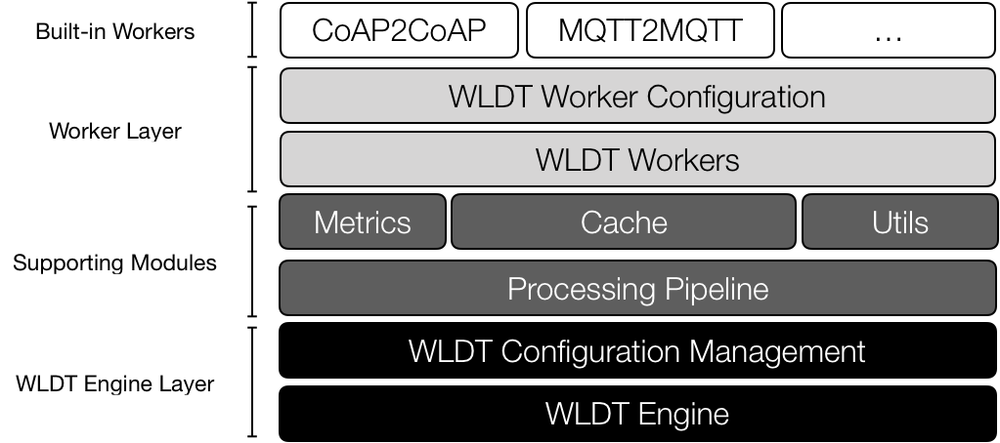

# WhiteLabel Digital Twin Framework - Core Library

Core library and repository of the White Label Digital Twin (WLDT) 
Framework. The WLDT intends to maximize modularity, re-usability and flexibility in order to effectively mirror 
physical smart objects in their digital counterparts. 
The proposed library focuses on the simplification of twins design and 
development aiming to provide a set of core features and 
functionalities for the widespread adoption of Internet of Things digital twins applications. 

A White Label Digital Twin (WLDT) instance is a general purpose software agent 
implementing all the features and functionalities of a Digital Twin running 
in cloud or on the edge. It has the peculiar characteristic 
to be generic and ``attachable'' to any physical thing in order to 
impersonate and maintain its digital replica and extend the provided functionalities 
for example through the support of additional protocols or a specific translation 
or normalization for data and formats.

Hereafter, the requirements that led the design and development of the WLDT framework are: 
- i) Simplicity - with WLDT developers must have the possibility to easily create a new instance by using 
existing modules or customizing the behavior according the need of their application scenario; 
- ii) Extensibility - while WLDT must be as simple and light as possible, 
the API should be also easily extendible in order to let programmers to personalize 
the configuration and/or to add new features loading and executing multiple modules at the same times;
- iii) Portability & Micorservice Readiness - a digital twin implemented through WLDT must 
be able to run on any platform without changes and customization. Our goal is to have a simple and light core engine 
with a strategic set of IoT-oriented features allowing the developer to easily create DT applications modeled 
as independent software agents and packed as microservices.

The core layer of the solution is the WLDT Engine designed 
to handle and orchestrate available and active modules 
(denoted as Workers) defining the behavior of the twin. 
A Worker is the the active module of the framework and it 
is designed to implement a specific twin's task or feature 
related for example to the synchronization with the 
original physical counterpart through a target IoT protocol. 
WLDT Workers' implements all the available communication 
protocols supported by the digital replica involving 
both standard and well known protocols such as 
CoAP or MQTT. 
Legacy protocols may be adopted in specific IoT deployments through the implementation of a dedicated module. Each worker is responsible to support both Request/Response or Pub/Sub paradigms and synchronization 
features for both incoming and outgoing communications. 

